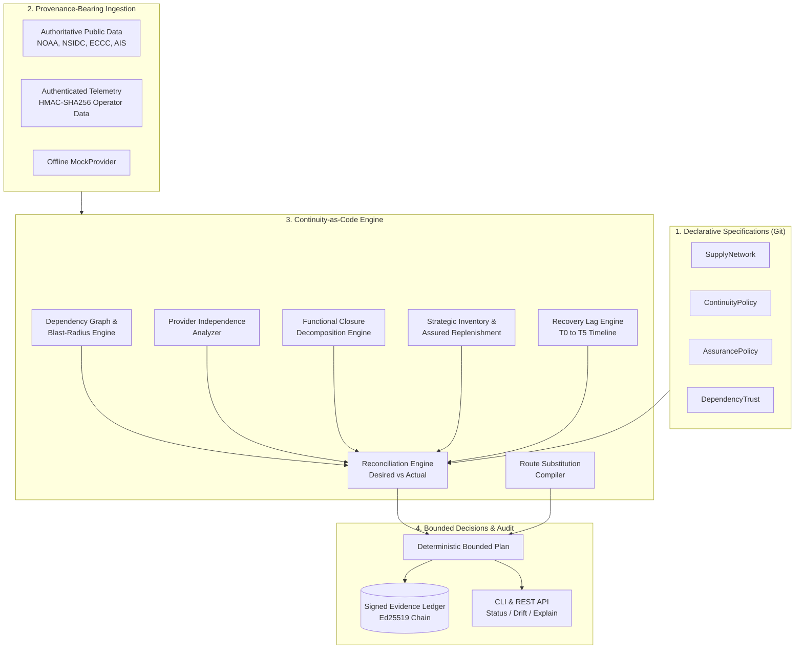
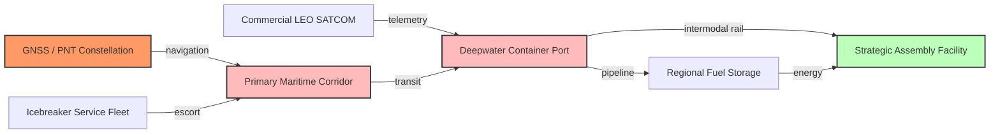
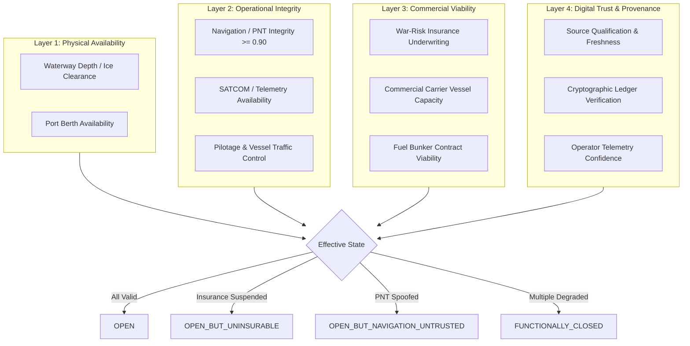
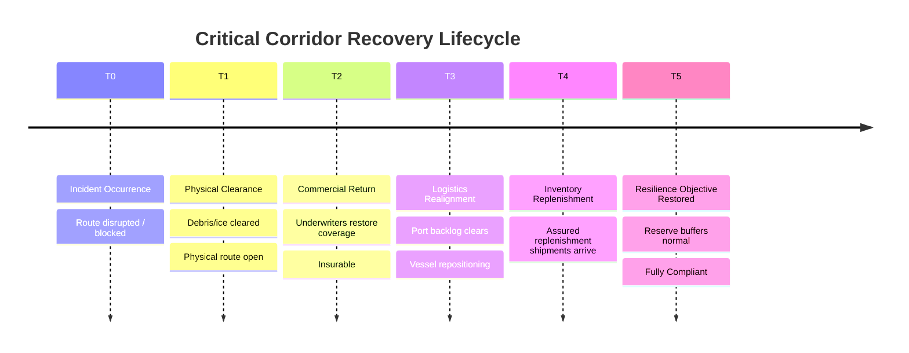
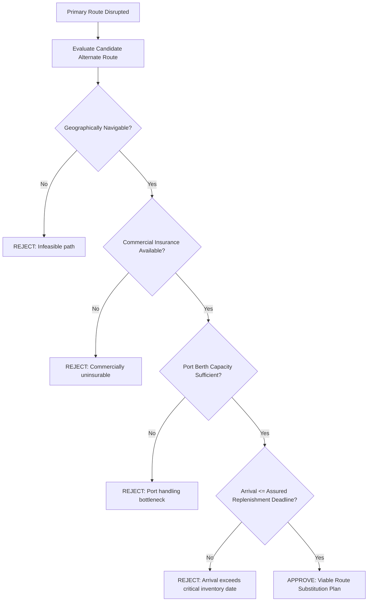

# ContinuityOS (v1.0)

<!-- BEGIN: REPO HERO -->

<!-- END: REPO HERO -->

[](https://github.com/Hardonian/continuityos/actions/workflows/ci.yml)
[](LICENSE)
[](https://www.python.org/downloads/)
[](https://github.com/Hardonian/continuityos)
[](https://github.com/astral-sh/ruff)
[](https://mypy-lang.org/)

> **Declare resilience. Detect drift. Prove continuity.**

**ContinuityOS** is an open-source **Continuity-as-Code / Resilience-as-Code** engine for modeling cyber-physical dependencies, simulating correlated multi-event disruptions, detecting functional infrastructure closures, calculating assured replenishment timelines, and continuously proving whether critical operations remain resilient.

---

## At a Glance (First 60 Seconds)

### What is ContinuityOS?
The first open-core declarative policy and reconciliation runtime for cyber-physical supply chains, maritime corridors, critical infrastructure, and distributed logistics networks.

### Why does it exist?
Traditional Infrastructure-as-Code (Terraform, OpenTofu) asks: *"Is my infrastructure configured as intended?"*  
Kubernetes asks: *"Is my workload converging toward desired state?"*  
**ContinuityOS asks:** *"Can the organization still function when physical, digital, commercial, logistical, regulatory, communications, navigation, or geopolitical dependencies fail?"*

### Why isn't monitoring enough?
Monitoring alerts you when a link is down. It cannot tell you that an open route is commercially dead because underwriters withdrew war-risk insurance, or that two satellite providers share the same vulnerable teleport, or that emergency burn rates will exhaust critical fuel 11 days before the first viable replacement ship arrives.

### What does Continuity-as-Code mean?
Defining operational resilience targets, minimum reserve days, provider diversity rules, and contingency routes in declarative YAML (`apiVersion: continuity.io/v1`), versioning them in Git, evaluating them against real-world multi-factor observations, and reconciling desired resilience against observed state in CI/CD.

---

## 5-Minute Quickstart

ContinuityOS is **100% offline-capable** and requires **zero cloud dependencies**.

```bash
# 1. Clone & install
git clone https://github.com/Hardonian/continuityos.git
cd continuityos
uv sync --all-extras

# 2. Run system doctor
uv run continuity doctor

# 3. Validate declarative resilience policy
uv run continuity validate examples/arctic/network.yaml

# 4. Compile a bounded mitigation plan against observed disruption
uv run continuity plan examples/arctic/network.yaml

# 5. Run the complete interactive demonstration
uv run continuity demo arctic
```

### Terminal Output: `continuity plan`

```text
================================================================================
CONTINUITYOS PLAN
================================================================================

Network:
  northern-critical-supply

Declared Continuity: 95.0%
Observed Continuity: 81.4%
STATUS: DEGRADED

VIOLATIONS:

[COMM-001]
  Required independent communication providers: 2
  Effective independent providers: 1 (Shared ground station: gateway/tromso-uplink)

[INV-003]
  Required assured fuel replenishment: <= 30 days
  Observed: 41 days (Critical reserve breach in 22 days)

[ROUTE-004]
  Primary route (corridor/nsr) physically OPEN
  Operational State: DEGRADED (Navigation integrity 0.65 < 0.90)
  Commercial State: UNAVAILABLE (War-risk insurance suspended)
  Effective State: FUNCTIONALLY_CLOSED

RECOMMENDED ACTIONS:
  1. [SUB-01] Activate Atlantic Corridor substitution route (viability: 88.0%)
  2. [INV-02] Increase regional fuel reserve buffer by 11 days
  3. [COMM-03] Provision independent protected UHF/SATCOM fallback

PREDICTED CONTINUITY AFTER REMEDIATION: 96.3%
================================================================================
```

---

## The 10 Core Invariants

ContinuityOS enforces 10 strict architectural invariants:

1. **Physical availability is not effective availability**: Infrastructure physically clear is unusable if uninsurable, carrier-denied, or navigation-untrusted.
2. **`UNKNOWN` never silently becomes `HEALTHY`**: Incomplete data or provider timeouts produce conservative degraded or unknown states, never assumed compliance.
3. **External state must preserve provenance**: Every observation tracks source qualification, cryptographic hash, timestamp, and signature status.
4. **Deterministic evaluation**: Given identical graph topology and observations, policy and compiler results are bit-for-bit reproducible.
5. **Graceful provider degradation**: Provider failure or timeout degrades confidence scores without crashing runtime execution.
6. **Every effective-state decision is explainable**: No black-box decisions; every closure or drift generates clear factor-level reason codes.
7. **Correlated failures are explicitly representable**: Multi-corridor, multi-modal cascading disruptions are modeled as first-class `Scenario` resources.
8. **Recovery is separate from reopening**: Physical reopening ($T1$) does not equate to operational health ($T5$) due to vessel repositioning and port backlog lag.
9. **Nominal redundancy must be tested for shared dependencies**: Redundant systems sharing upstream teleports, power grids, or carriers are flagged as invalid redundancy.
10. **Machine-readable and versionable**: Policies are declarative, portable, testable, and commit-ready in standard Git workflows.

---

## Architecture & Workflows

### 1. System Architecture Loop



---

### 2. Dependency Graph & Blast-Radius Modeling



---

### 3. Functional Closure: 4-Layer Decomposition

Resilience is multi-dimensional. A corridor is only functionally open when all four layers pass:



---

### 4. Recovery Lag Timeline ($T0 \to T5$)

Reopening a route does **not** instantly restore network continuity. ContinuityOS explicitly models the multi-stage lag:



---

### 5. Multi-Constraint Route Substitution Compiler

ContinuityOS does not merely draw an alternative line on a map; it compiles multi-constraint supply configurations:



---

## Declarative Resource Specifications (`continuity.io/v1`)

### `AssurancePolicy` (Quantified Resilience Budget)
```yaml
apiVersion: continuity.io/v1
kind: AssurancePolicy
metadata:
  name: northern-critical-supply
spec:
  continuityObjective:
    minimum: 0.95
  tolerate:
    corridorLoss: 1
    portLoss: 1
    communicationProviderLoss: 1
    navigationSourceLoss: 2
    observationSourceLoss: 1
  evidence:
    minimumIndependentOperationalSources: 2
    minimumIndependentNavigationSources: 3
  commercial:
    minimumCarrierOptions: 2
    insuranceRequired: true
  inventory:
    minimumReserveDays: 30
    minimumAssuredReplenishmentCycles: 1
  recovery:
    verifyCarrierReturn: true
    verifyBacklogClearance: true
    verifyReserveRestoration: true
```

### `RouteSubstitution` (Alternate Logistics Configuration)
```yaml
apiVersion: continuity.io/v1
kind: RouteSubstitution
metadata:
  name: arctic-atlantic-contingency
spec:
  primaryRouteId: corridor/nsr
  alternateRouteId: corridor/atlantic
  candidateName: North Atlantic Maritime Route
  requiredVesselClass: Ice-Class 1A
  originCapacityTonnes: 500000.0
  routeCapacityTonnes: 450000.0
  portHandlingCapacityTonnes: 380000.0
  inlandRailCapacityTonnes: 320000.0
  carrierAvailable: true
  insuranceAvailable: true
  fuelBunkerAvailable: true
  transitDays: 28.0
  criticalArrivalDeadlineDays: 35.0
```

---

## CLI Command Reference

ContinuityOS includes 26 commands across core resilience, assurance, simulation, and audit:

| Command | Description |
| :--- | :--- |
| `continuity init <dir>` | Scaffold a new Continuity-as-Code workspace with starter manifests |
| `continuity validate <file>` | Validate declarative specs against JSON Schemas |
| `continuity plan <file>` | Compile deterministic bounded mitigation plans with predicted recovery |
| `continuity drift <file>` | Reconcile declared resilience policy against observed reality |
| `continuity simulate <scenario>` | Simulate correlated cascade disruptions over time ($N$ days) |
| `continuity explain <resource>` | Decompose functional closure root causes across 4 architectural layers |
| `continuity assurance <policy>` | Evaluate comprehensive resilience budget scorecard |
| `continuity substitute <spec>` | Compile and validate multi-constraint route substitution feasibility |
| `continuity graph <file>` | Analyze dependency topology, cycles, SPOFs, and blast radius |
| `continuity observe [--mock]` | Ingest live authoritative data or run offline mock observations |
| `continuity inventory <file>` | Forecast time-series depletion, burn rates, and assured replenishment |
| `continuity recovery <file>` | Model T0-T5 recovery lag timeline and critical path delays |
| `continuity evidence <subcmd>` | Inspect, list, verify, and detect conflicts in the signed evidence ledger |
| `continuity demo [scenario]` | Run interactive deterministic offline demonstration (`arctic` / `civilian`) |
| `continuity doctor` | Run full diagnostic suite (Python 3.12, Ed25519, schemas, offline data) |
| `continuity sovereign-audit` | Verify air-gap readiness, cryptographic key isolation, and SCIF controls |
| `continuity version` | Display engine version and build metadata |

---

## Open-Core vs. Enterprise Boundary

ContinuityOS is committed to a robust open-source core:

| Feature / Capability | Open-Source Core | Enterprise / Sovereign Edition |
| :--- | :---: | :---: |
| Declarative DSL (`continuity.io/v1`) | Yes | Yes |
| Full Dependency Graph & Blast-Radius Engine | Yes | Yes |
| 12-State Functional Closure Decomposition | Yes | Yes |
| 9-Dimensional DependencyTrust Engine | Yes | Yes |
| Correlated Disruption Simulator | Yes | Yes |
| Assured Replenishment & Inventory Depletion | Yes | Yes |
| Multi-Constraint Route Substitution Compiler | Yes | Yes |
| Provider Independence Upstream Analyzer | Yes | Yes |
| Signed SHA-256 / Ed25519 Evidence Ledger | Yes | Yes |
| CLI & Local Offline-First Runtime | Yes | Yes |
| Distributed HA Control Plane & Multi-Tenancy | Roadmap | Yes |
| Enterprise RBAC & Single Sign-On (SAML/OIDC) | Roadmap | Yes |
| Private Sovereign Satellite & Radar Connectors | DIY / SDK | Included |
| Real-Time Commercial Carrier & Insurance Feeds | External | Certified Connectors |
| Multi-Domain Guard / SCIF Cross-Domain Data Diode | Specification | Turnkey Appliance |

---

## Defensive-Only ROE & Legal Boundary

ContinuityOS is engineered strictly for **defensive resilience planning, business continuity, critical infrastructure protection, civil logistics, and disaster recovery**.

- **No Offensive Targeting**: We do not implement kinetic strike planning, weapon routing, or offensive cyber operations.
- **No Autonomous Kinetic Control**: The runtime is strictly advisory. Every mitigation, substitution, and recovery action requires explicit human authorization.
- **Privacy & Civil Protections**: Data collection focuses exclusively on infrastructure health, asset telemetry, and macro-environmental feeds.

---

## Documentation Index

- [Architecture & Invariants](docs/ARCHITECTURE.md)
- [Policy Language Reference](docs/POLICY_LANGUAGE.md)
- [Provider SDK & Adapters](docs/PROVIDER_SDK.md)
- [Scenario Modeling Guide](docs/SCENARIOS.md)
- [Performance Benchmarks](docs/BENCHMARKS.md)
- [Deployment & Air-Gapped Operation](docs/DEPLOYMENT.md)
- [Threat Model & Security Policy](SECURITY.md)
- [Product Positioning & GTM Strategy](docs/gtm/product-positioning.md)
- [Contributing Guidelines](CONTRIBUTING.md)

---

## License

ContinuityOS is released under the [Apache 2.0 License](LICENSE).  
Copyright (c) 2026 ContinuityOS Contributors & Hardonia AI Systems.
