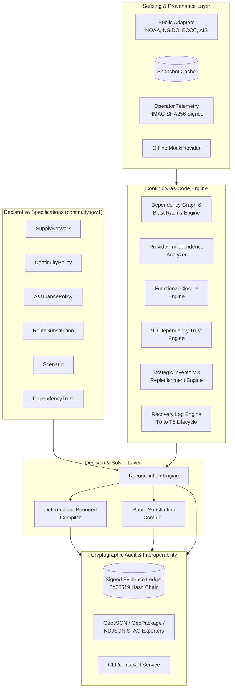
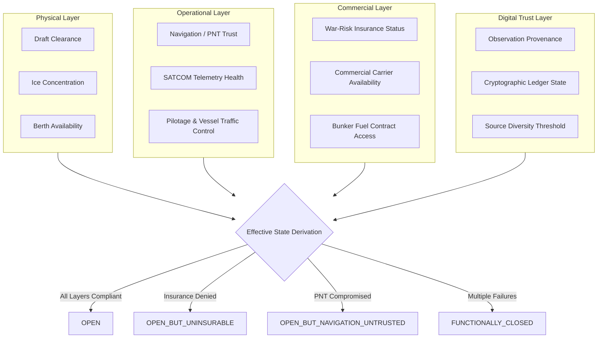
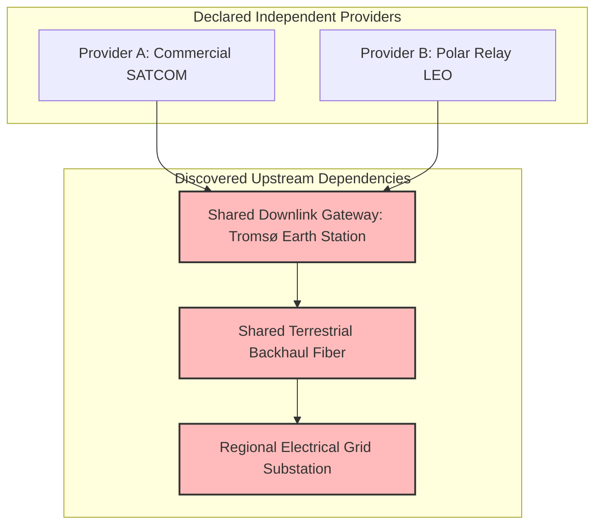

# ContinuityOS Architecture Specification (v1.0)

## 1. Architectural Philosophy

Traditional Infrastructure-as-Code (Terraform, Pulumi) operates on the premise of desired configuration:
> *Is resource X provisioned with configuration Y?*

Kubernetes operates on desired workload convergence:
> *Are N replicas of pod Z running and passing readiness checks?*

**ContinuityOS operates on desired operational resilience:**
> *Will critical supply lines, logistical corridors, and operational capabilities function when primary physical, digital, commercial, or regulatory dependencies degrade or fail?*

The core runtime evaluates continuous state reconciliation:

```text
DECLARED RESILIENCE POLICY (Git)
             ↓
MULTI-FACTOR DEPENDENCY GRAPH
             ↓
PROVENANCE-QUALIFIED OBSERVATIONS (Public Data + Operator Telemetry)
             ↓
DEPENDENCY TRUST EVALUATION (9-Dimensional Matrix)
             ↓
FUNCTIONAL CLOSURE CLASSIFICATION (Physical, Operational, Commercial, Trust)
             ↓
RECONCILIATION & DRIFT DETECTION
             ↓
COMPLIANT / DRIFT / DEGRADED / FUNCTIONALLY_CLOSED / UNKNOWN
             ↓
DETERMINISTIC MITIGATION COMPILER (Exact-Solver Bounded Search)
             ↓
MULTI-CONSTRAINT ROUTE SUBSTITUTION
             ↓
TIME-TO-RESTORE & RECOVERY VERIFICATION (T0 -> T5)
             ↓
SIGNED EVIDENCE LEDGER (Ed25519 Cryptographic Chain)
```

---

## 2. Core Subsystems & Component Topology



---

## 3. The 12-State Operational Model

Resilience in complex physical-digital networks is non-binary. Infrastructure can remain physically intact while becoming completely unusable. ContinuityOS evaluates effective operational state across a 12-state taxonomy:

1. **`OPEN`**: Fully operational, certified, and compliant with all policy thresholds.
2. **`OPEN_DEGRADED`**: Transit feasible, but elevated environmental or operational factor risk is observed.
3. **`OPEN_CAPACITY_CONSTRAINED`**: Physical route clear, but throughput/berth capacity is throttled.
4. **`OPEN_BUT_UNINSURABLE`**: Waterway physically navigable, but marine insurers or war-risk syndicates have withdrawn coverage.
5. **`OPEN_BUT_NO_CARRIER_CAPACITY`**: Infrastructure open, but commercial container/bulk shipping operators have diverted vessels.
6. **`OPEN_BUT_NAVIGATION_UNTRUSTED`**: Geographic coordinates accessible, but GNSS spoofing or PNT jamming renders automated navigation unsafe.
7. **`OPEN_BUT_COMMUNICATIONS_DEGRADED`**: Physical route open, but solar storms or cyber disruption sever SATCOM links.
8. **`OPEN_BUT_SERVICE_DEPENDENT`**: Passage open only with specialized external escort (e.g., sole-source icebreaker or harbor tugs).
9. **`RECOVERY_BACKLOGGED`**: Physical route reopened, but severe port congestion and vessel displacement prevents normal transit.
10. **`FUNCTIONALLY_CLOSED`**: Multi-layer operational, commercial, or trust failures render infrastructure unusable despite physical status.
11. **`PHYSICALLY_CLOSED`**: Physical destruction, structural collapse, or unnavigable sea ice barriers.
12. **`UNKNOWN`**: Insufficient observations or provider downtime. Never silently treated as healthy.

---

## 4. Functional Closure Decomposition Engine (`closure.py`)

Functional closure decomposes complex cyber-physical assets across four orthogonal layers:



### Deterministic Derivation Rules
- If physical barrier exists $\to$ `PHYSICALLY_CLOSED`.
- If physical route is open, but commercial insurance is withdrawn $\to$ `OPEN_BUT_UNINSURABLE`.
- If navigation trust $< \text{threshold}$ $\to$ `OPEN_BUT_NAVIGATION_UNTRUSTED`.
- If communications trust $< \text{threshold}$ $\to$ `OPEN_BUT_COMMUNICATIONS_DEGRADED`.
- If carrier capacity unavailable $\to$ `OPEN_BUT_NO_CARRIER_CAPACITY`.
- If recovery backlog is active $\to$ `RECOVERY_BACKLOGGED`.
- If two or more operational/commercial failures coincide $\to$ `FUNCTIONALLY_CLOSED`.

---

## 5. Dependency Trust Matrix (`trust.py`)

Rather than condensing trust into a single lossy scalar, `DependencyTrust` maintains nine independent dimensions:

| Dimension | Description | Minimum Valid Policy Assertion |
| :--- | :--- | :---: |
| `physical_availability` | Concrete physical accessibility and capacity | 0.0 – 1.0 |
| `cyber_integrity` | Cryptographic integrity, firmware state, and network health | 0.0 – 1.0 |
| `legal_availability` | Sanctions compliance, cabotage laws, and regulatory clearance | 0.0 – 1.0 |
| `commercial_availability` | Market capacity and charter availability | 0.0 – 1.0 |
| `communications_integrity` | SATCOM/telemetry bit-error rate and jamming resistance | 0.0 – 1.0 |
| `navigation_integrity` | GNSS dilution of precision, spoofing detection, and PNT trust | 0.0 – 1.0 |
| `insurance_availability` | Underwriting syndicate coverage and war-risk rate stability | 0.0 – 1.0 |
| `operator_confidence` | Verified on-scene operator reporting confidence | 0.0 – 1.0 |
| `information_confidence` | Cross-source corroboration and sensor freshness | 0.0 – 1.0 |

Trust aggregation supports three explicit strategies:
- `minimum`: Conservative fail-closed minimum across all active dimensions.
- `weighted`: User-defined normalized weight vector across dimensions.
- `mean`: Arithmetic mean for non-critical informational reporting.

---

## 6. Provider Independence & Upstream Topology (`independence.py`)

A common vulnerability in resilience planning is **false redundancy**—declaring two redundant communications or logistics providers that secretly share an unmodeled single point of failure upstream.



`ProviderIndependenceAnalyzer` traverses upstream dependency DAGs to detect:
- Shared ground teleports and satellite downlinks.
- Shared cloud regions or transit providers.
- Shared sovereign jurisdictions subject to common regulatory interdiction.
- Shared fuel bunkering terminals and physical transit bottlenecks.

If declared independent providers share $\ge 1$ upstream nodes, the analyzer flags `valid: false` and downgrades effective provider redundancy.

---

## 7. Strategic Inventory & Assured Replenishment (`inventory.py`)

Traditional inventory models calculate static reserve days:
$$\text{Reserve Days} = \frac{\text{Current Stock}}{\text{Average Daily Burn}}$$

In real-world crises, this metric is dangerously misleading because burn rates surge while replenishment routes are disrupted. ContinuityOS computes **Assured Replenishment Days**:
$$\text{Assured Replenishment Days} = \max(\text{Transit Days}, \text{Lead Time}) + \text{Disruption Recovery Lag}$$

```mermaid
gantt
    title Critical Inventory Burn & Replenishment Timeline
    dateFormat X
    axisFormat Day %d
    section Stock Level
    Normal Stock (100%)       :done, 0, 13
    Warning Buffer (50%)      :active, 13, 22
    Critical Reserve (20%)    :crit, 22, 29
    Stock Exhausted (0%)      :crit, 29, 43
    section Replenishment
    Corridor Severed          :crit, 0, 15
    Contingency Route Dispatched :active, 15, 43
    First Shipment Arrives    :milestone, 43, 43
    Reserve Restored          :done, 43, 62
```



The engine tracks day-by-day depletion under three dynamic consumption regimes:
- `normal_burn`: Baseline standard operational consumption.
- `degraded_burn`: Demand-throttled consumption under conservation policies.
- `emergency_burn`: Surge consumption under crisis or extreme weather operations.

---

## 8. Recovery Lag Lifecycle ($T0 \to T5$) (`recovery.py`)

ContinuityOS enforces Invariant 8: *Recovery is separate from reopening.* The timeline models five discrete milestones:

```text
T0 (Incident): Sudden disruption event occurs (e.g., canal blockage, cyber outage).
 │
 ├── Physical Reopening Lag (e.g., salvage, dredging, ice clearing)
 ↓
T1 (Physical Reopening): Asset is physically passable, but commercially unusable.
 │
 ├── Underwriter Review & Risk Re-evaluation Lag
 ↓
T2 (Commercial Participation): War-risk insurance normalized, charter contracts restored.
 │
 ├── Port Clearance & Container Vessel Repositioning Lag
 ↓
T3 (Capacity Normalized): Vessel transit volumes return to baseline throughput.
 │
 ├── Supply Chain In-Transit Transit & Delivery Lag
 ↓
T4 (Inventory Replenished): Regional depots rebuild baseline critical reserves.
 │
 ├── Resilience Margin Rebuilding & Contingency Restocking
 ↓
T5 (Resilience Objective Restored): Network returns to full policy compliance.
```

---

## 9. Multi-Constraint Route Substitution (`substitution.py`)

Finding a valid alternative route is not a shortest-path graph problem. An alternative route is only viable if it simultaneously satisfies nine operational constraints:

1. **Geographic Feasibility**: Waterway depth, air draft, and lock dimensions.
2. **Ice / Environmental Class**: Fleet ice-class certification matching route ice severity.
3. **Origin Dispatch Capacity**: Origin terminal throughput for diversion volumes.
4. **Transit Route Capacity**: Chokepoint volume limits along the alternate corridor.
5. **Port Handling Capacity**: Receiving port crane and berth capacity.
6. **Inland Intermodal Capacity**: Downstream rail, barge, or trucking capacity.
7. **Commercial Insurance**: Marine underwriters actively writing coverage.
8. **Fuel Bunkering**: Intermediate bunker fuel availability.
9. **Critical Arrival Deadline**: $\text{Transit Days} \le \text{Days to Inventory Exhaustion}$.

If any constraint fails, the compiler rejects the candidate and generates specific deficiency codes (e.g., `CAPACITY_PORT_HANDLING_INSUFFICIENT`, `ARRIVAL_AFTER_DEADLINE`).

---

## 10. Bounded Deterministic Mitigation Compiler (`compiler.py`)

Mitigation planning uses an exact-solver approach for bounded action sets ($N \le 24$ actions by default, with OR-Tools adapters available for enterprise fleets). Given:
- A set of detected policy violations $\mathcal{V}$.
- A candidate mitigation action pool $\mathcal{A}$, where each action $a \in \mathcal{A}$ has cost $c(a)$, restored continuity $\Delta r(a)$, prerequisite actions $\mathcal{P}(a)$, and mutually exclusive incompatibilities $\mathcal{I}(a)$.
- An overall resource budget constraint $B$.

The compiler finds the optimal action subset $S^* \subseteq \mathcal{A}$ that maximizes aggregate continuity restoration:
$$\max_{S \subseteq \mathcal{A}} \sum_{a \in S} \Delta r(a) \quad \text{subject to} \quad \sum_{a \in S} c(a) \le B, \quad \mathcal{P}(a) \subseteq S, \quad S \cap \mathcal{I}(a) = \emptyset$$

Because the search is deterministic, repeated runs on identical inputs yield bit-for-bit identical plans.

---

## 11. Signed Evidence Ledger (`evidence.py`)

Auditability is cryptographically enforced. Every ingested observation, policy reconciliation, and compiled mitigation plan is recorded as an immutable record in an append-only hash chain:

$$H_i = \text{SHA-256}(H_{i-1} \parallel \text{RecordType} \parallel \text{SubjectID} \parallel \text{Timestamp} \parallel \text{CanonicalJSON(Payload)})$$

When cryptographic keys are provisioned, each record is signed using Ed25519 (`ed25519_ph`). The verification engine validates:
- Bit-for-bit SHA-256 hash-chain integrity from root genesis to head.
- Ed25519 digital signatures against authorized public keys.
- Monotonic sequence timestamps and nonces preventing replay attacks.
